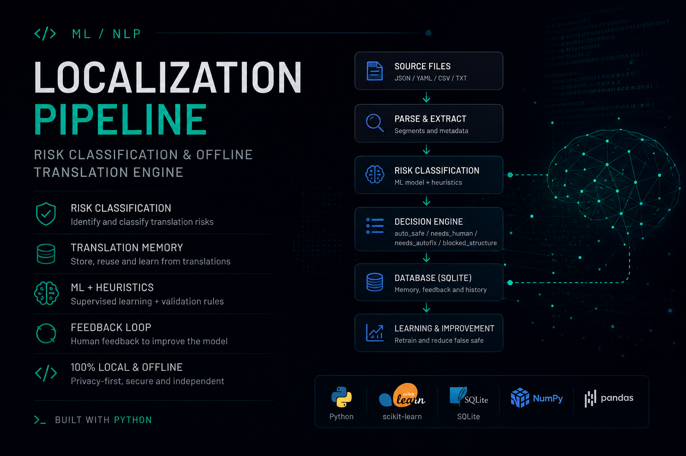

# CK3 PT-BR Localization Pipeline

Sistema local/offline para traduzir, revisar e refinar a localização do Crusader Kings III para Português do Brasil, gerando um mod que substitui o pacote espanhol.

O projeto preserva a estrutura dos arquivos `.yml` do CK3 e combina:

- SQLite como base de conhecimento local;
- memória de tradução;
- validações determinísticas;
- revisão humana;
- aprendizado local;
- relatórios e dashboard de acompanhamento.

## Estrutura

```text
source/      fontes do jogo e referência histórica local
output/      saída final do mod
pipeline/    scripts e orquestração do pipeline
memory/      banco SQLite, modelos e dados locais
docs/        documentação estável do projeto
prompts/     prompts temporários ignorados pelo Git
reports/     relatórios gerados
logs/        logs de execução
dashboard/   dashboard local de análise
```

`source/`, `output/`, `memory/`, `reports/`, `logs/` e `prompts/` não são versionados.

## Documentação

- [Guia de comandos](docs/commands.md)
- [Aprendizado guiado do ML local](docs/ml_guided_learning.md)
- [Documentação da pasta docs](docs/README.md)
- [Exceções contextuais de localização](docs/contextual_localization_exceptions.md)
- [Tokens de gênero PT-BR](docs/gender_tokens_ptbr.md)

## Segurança

O ML não deve aplicar traduções livremente nem alterar `output/spanish` sem uma etapa explícita de aplicação.

Regra de ouro:

```text
ML recomenda.
Regras bloqueiam.
Humano confirma.
```

Tokens, placeholders, comandos CK3 e confirmações humanas manuais devem ser preservados.

